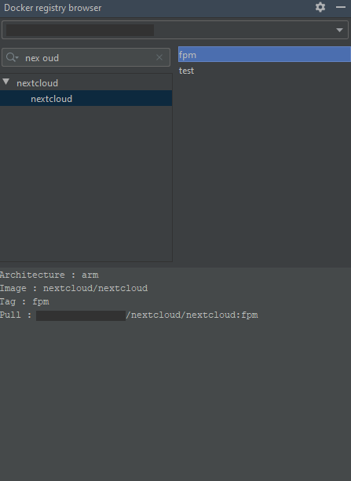

# Private docker registry browser
This plugin allow to browse and search [private docker registry](https://docs.docker.com/registry/).  
It use [registry api v2](https://docs.docker.com/registry/spec/api/) to display registry tree, image tags and basic
image information.

## Build and install
```
Linux :
./gradlew buildPlugin

Windows :
gradlew.bat buildPlugin
```

and then, install using the zip file in build/distributions

## Configuration
Right now it use registries defined with the official
[docker plugin](https://plugins.jetbrains.com/plugin/7724-docker)

Note : it does not support authentication

## Feature
* Filter image tree

## Screenshot



## TODO
* Delete tag
* Paginated catalog and tag ?